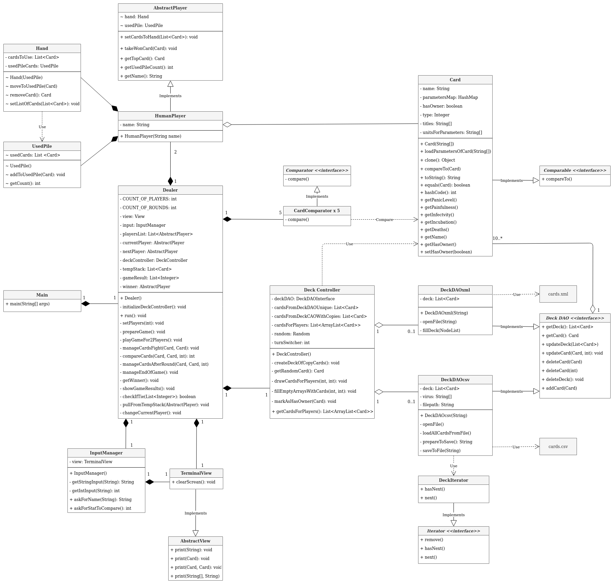
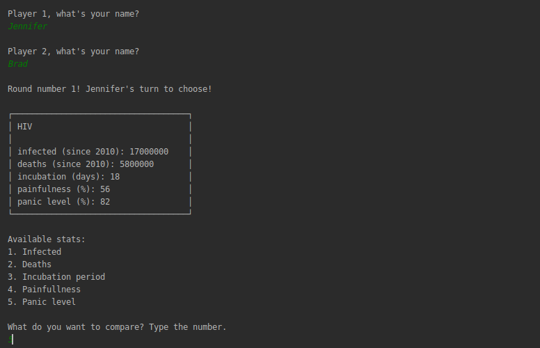
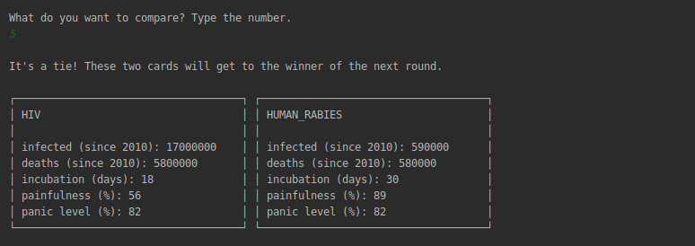
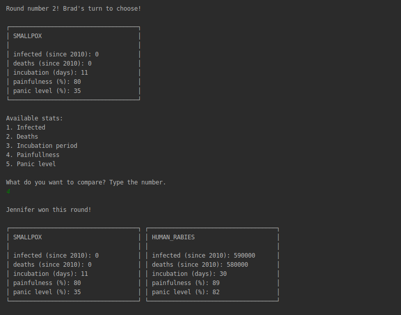
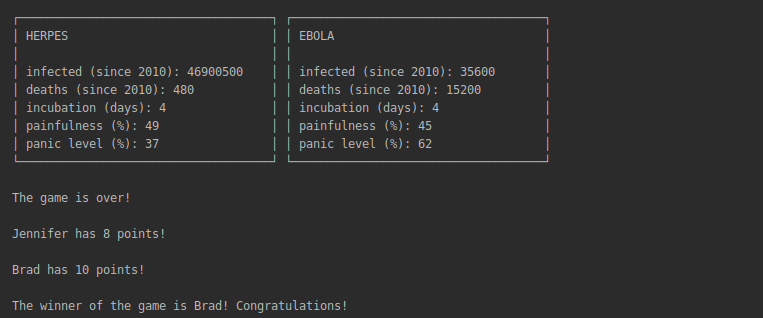

# Java exercise 5 - Battle Cards
2 weeks project, developed in 3-person group, aiming at creating a card game based on comparing statistics of cards drawn for players.

A theme of the following implementation of the game are viruses. Each virus has five attributes: infectivity, deaths, incubation period, painfulness and panic level. Each player has a turn during which they choose which attribute they can use to compare to the opponent.
## UML class diagram
The class diagram was discussed and drawn at the beginning of the development process. The structure was based on implementing:
* **5 packages:** application, interactions, card, deck and player 
* 4 interfaces: Comparator, Comparable, Iterator (given by JAva) and DeckDAO (custom interface)
* several mixed design patterns: DAO, MVC, template method and decorator pattern.

## Game's scenario
The game starts with players giving their names (all the inputs are foolproof).

The first player has its first card shown and is asked to choose the comparison attribute:

After the choice, both cards are printed and the result is announced. In the scenario of a tie, both cards are put aside and are granted to the winner of the next round:

There are 10 such rounds. While winning the round, the player gets to take the opponent's card.

After 10-th round the won cards are counted and player with bigger amount of cards wins:

## Technologies
* Java SE 13
* IDE - IntelliJ
* JUnit 4

## Lessons learned from the assignment
* planning program's architecture
* planning group work, project management
* getting familiar with 4 design patterns
* working with git branches and pull requests
* implementing methods required by Comparator and Comparable interfaces
* implementing hashCode and equals methods, using enums

## Status
Project is finished.

## Credits
Project assigned and supervised by Codecool mentors.
